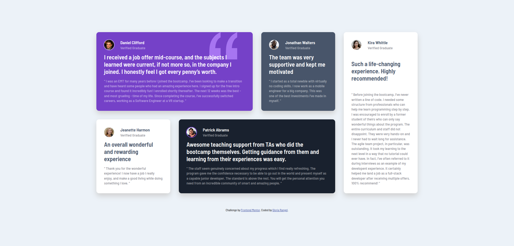
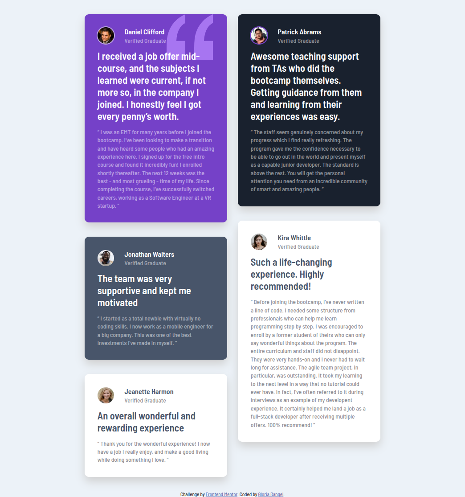

# 🖼 Frontend Mentor - Testimonials grid section solution

This is a solution to the [Testimonials grid section challenge on Frontend Mentor](https://www.frontendmentor.io/challenges/testimonials-grid-section-Nnw6J7Un7). Frontend Mentor challenges help you improve your coding skills by building realistic projects. 

##  📋 Table of contents

-  Overview

-  Screenshot

-  Links

-  My process

-  Built with

-  Useful resources

- What I learned

-  Author

-  Thanks

##  📖 Overview

This challenge is perfect for anyone looking to sharpen their **CSS Grid** skills. CSS Grid is a powerful layout tool that enables complex designs to be created with ease, and this project provides the ideal opportunity to get familiar with it.

The task is to build a testimonials section laid out using CSS Grid, ensuring that it matches the provided design as closely as possible. You can use any tools or libraries you feel comfortable with to complete the challenge, allowing you to practice techniques that you’d like to improve on.

**Key Features:**

-  The layout should adapt to various screen sizes, providing an optimal viewing experience across devices.
-  Ensure that the testimonials section is visually appealing and responsive, mimicking the design closely.

By completing this project, you'll gain more hands-on experience with CSS Grid and improve your ability to create flexible, responsive layouts.

###  📸 Screenshot

These are the screenshots of the implemented solution:

-  **🖥️ Desktop version**

-  **🔳 Tablet version**

-  **📱 Mobile version**

###  ⛓️ Links

-  HTML URL: [index.html](https://github.com/NorimNori/testimonials-grid-section/blob/main/index.html)

-  Styles URL: [styles folder](https://github.com/NorimNori/testimonials-grid-section/tree/main/styles)

-  Live Site URL: [on Netlify](https://testimonials-grid-section-by-gr.netlify.app/)

##  📌 My process

###  🪚 Built with

-  Semantic HTML5 markup

-  SCSS styles

-  Flexbox

-  CSS Grid

-  Mobile-first workflow

-  BEM class naming 

-  Google fonts

###  🔬 What I learned

Overall, this challenge was more about practicing **CSS Grid** rather than learning the fundamentals. However, I did face a new challenge with designing the tablet version of the layout, which I handled on my own. While the design itself was relatively simple, it gave me the opportunity to experiment with creating a **masonry-style two-column layout**, which was a fun problem to solve and added an interesting dynamic to the design.

In addition to this, I used **SCSS** for the styling, a tool I was already familiar with. Although I had previous experience with SCSS, this project allowed me to reinforce my skills and improve my workflow. I also had the chance to update my knowledge on best practices for organizing and structuring SCSS files, especially when it comes to using **variables**, **mixins**, and **nested selectors** for better maintainability and clarity.

###  📝 Useful resources

-  [Sass Basics](https://sass-lang.com/guide/) - This official guide to Sass (Syntactically Awesome Stylesheets) provides a comprehensive introduction to the basics of Sass, a powerful CSS preprocessor. It covers key concepts such as variables, nesting, mixins, and more, helping you streamline your CSS workflow, improve maintainability, and write cleaner, more efficient stylesheets.

##  👋 Author

-  LinkedIn - [Gloria Rangel](https://www.linkedin.com/in/gloria-rangel-06b960306/)

-  Frontend Mentor - [@NorimNori](https://www.frontendmentor.io/profile/NorimNori)

##  🌟 Thank You 🌟

Thanks for visiting this repository! I hope you found it useful and inspiring, or it was just a fun time.

A special thanks to [Frontend Mentor](https://www.frontendmentor.io) for the challenge and for being such an amazing platform to learn and grow as a developer.

Have a nice day! 😊
